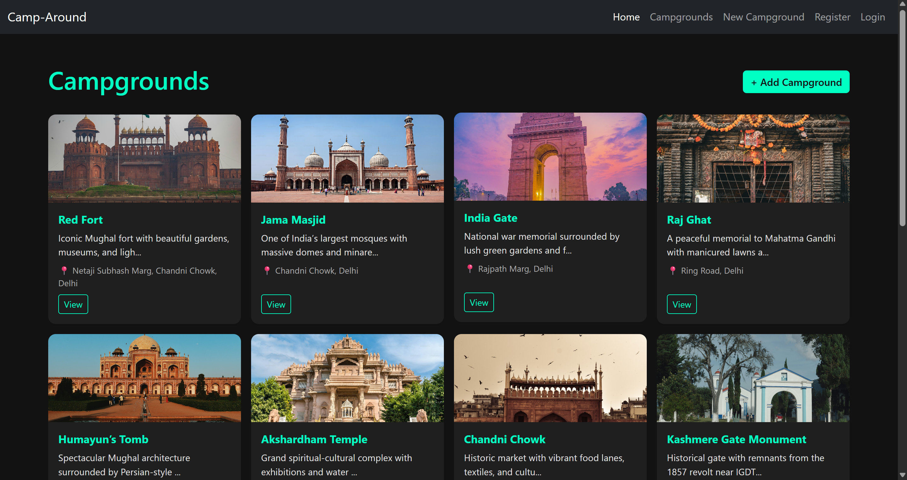
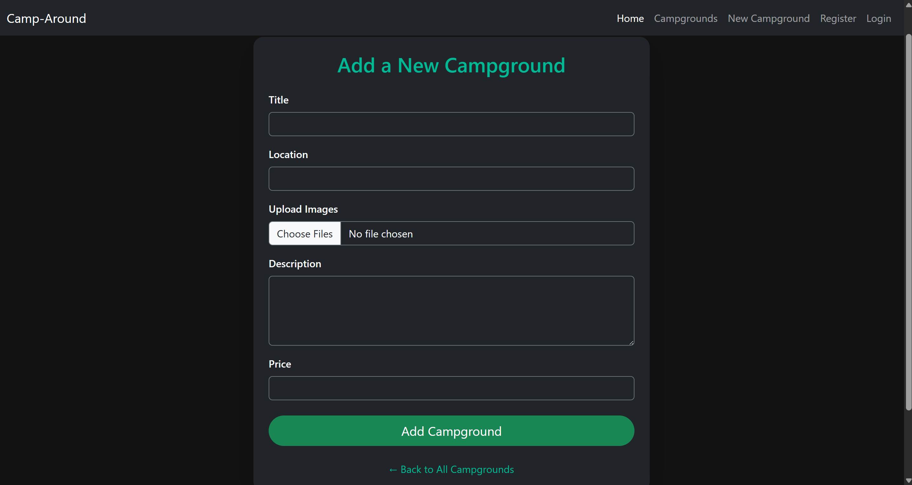
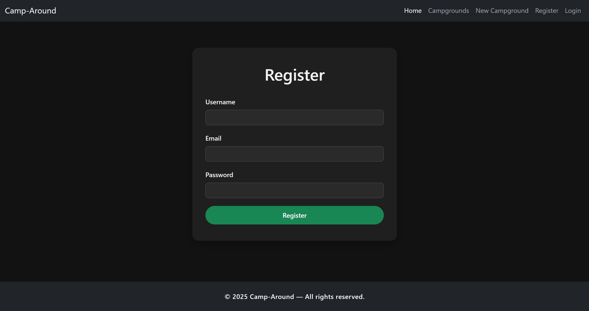
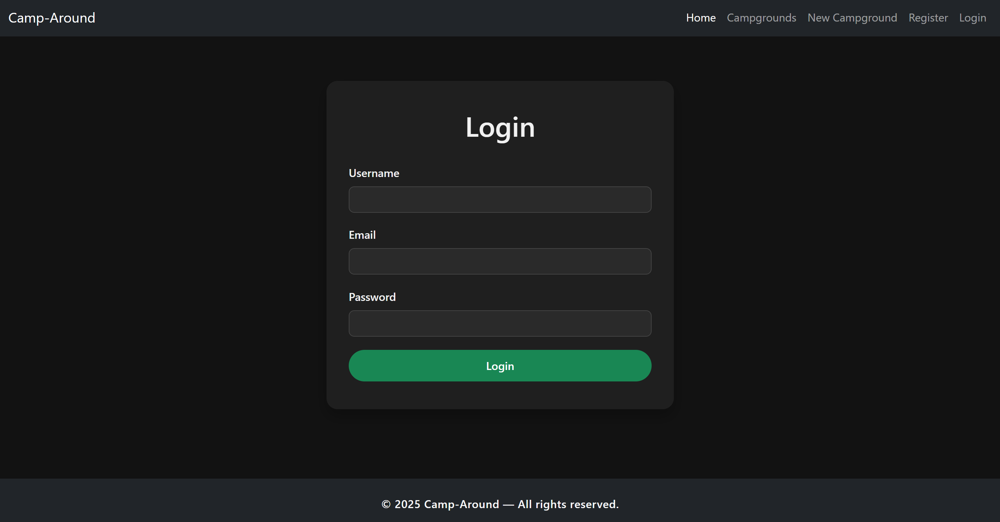
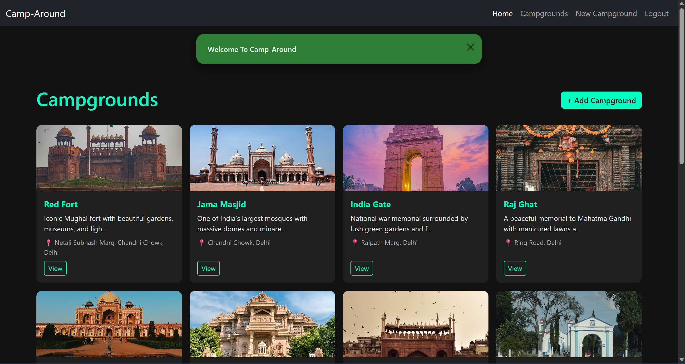
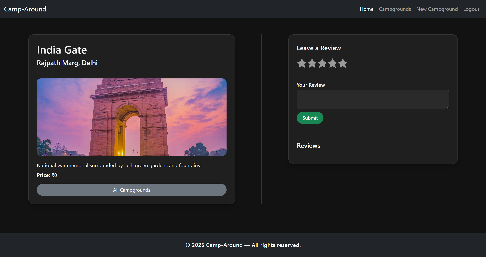

# Camp-Around

> **Local Campus Hangout Discovery Platform**  
> _Jan 2025 • Node.js • Express.js • MongoDB • EJS_

---

## Project Summary

**Camp-Around** is a full-stack web platform that helps students discover and review local hangout spots and campgrounds around their college campus. Designed with a minimal UI using **EJS templates**, the app allows users to browse, add, and manage campground listings and reviews with full **CRUD** functionality.

---

## Key Features

- **Explore 15–20+ curated hangout spots** around campus
- **Review System** – Create, update, and delete reviews for each location
- **Full CRUD Operations** – For both campground entries and user reviews
- **Upcoming Enhancements**:
  - Real-time **location tracking**
  - **Category- and location-based filtering**

---

## Tech Stack

- **Frontend**: EJS, HTML5, CSS3, Bootstrap
- **Backend**: Node.js, Express.js
- **Database**: MongoDB (via Mongoose ODM)

---

## Screenshots

> _UI Previews of Camp-Around Platform_

  
  
  
  
  
  
  

---

## In Progress

- Map based location services for real-time user positioning
- Filter system for search by distance, type, or popularity
- Integration of AI-based image tagging to automatically categorize campgrounds.

---
